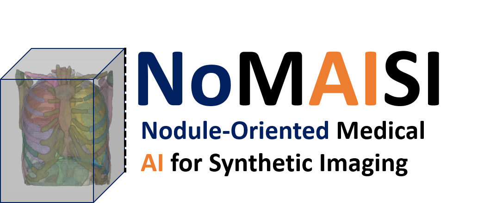

# NoMAISI 

  

**Nodule-Oriented Medical AI for Synthetic Imaging and Augmentation in Chest CT**

  

# NoMAISI: Nodule-Oriented Medical AI for Synthetic Imaging and Augmentation in Chest CT
NoMAISI (Nodule-Oriented Medical AI for Synthetic Imaging), a generative framework built on foundational backbones with flow-based diffusion and ControlNet conditioning.

# Abstract
Medical imaging datasets are increasingly available, yet abnormal and annotation-intensive cases such as lung nodules remain underrepresented. We developed NoMAISI (Nodule-Oriented Medical AI for Synthetic Imaging), a generative framework built on foundational backbones with flow-based diffusion and ControlNet conditioning. Using NoMAISI, we curated a large multi-cohort lung nodule dataset and applied context-aware nodule volume augmentation, including relocation, shrinkage to simulate early-stage disease, and expansion to model progression. Each case was rendered into multiple synthetic variants, producing a diverse and anatomically consistent dataset. Fidelity was evaluated with cross-cohort similarity metrics, and downstream integration into lung nodule detection, and classification tasks demonstrated improved external test performance, particularly in underrepresented lesion categories. These results show that nodule-oriented synthetic imaging and curated augmentation can complement clinical data, reduce annotation demands, and expand the availability of training resources for healthcare AI.
